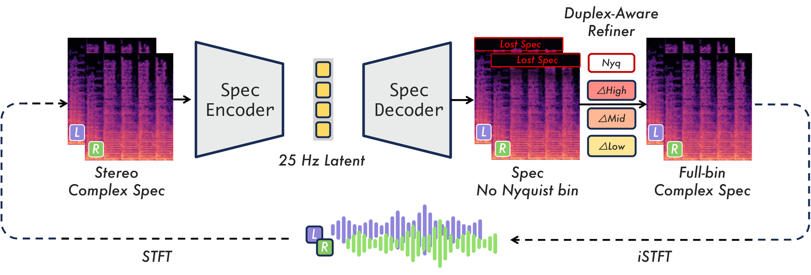
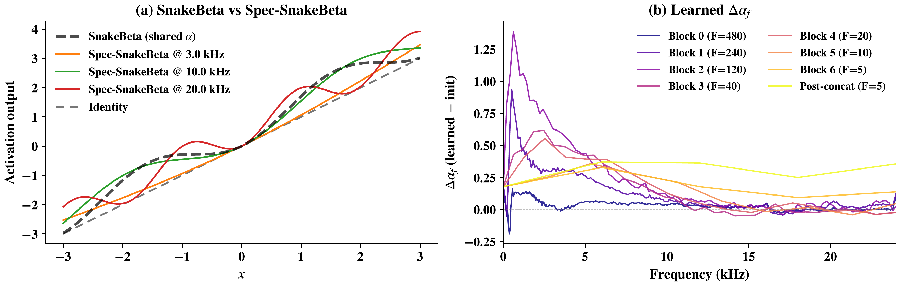
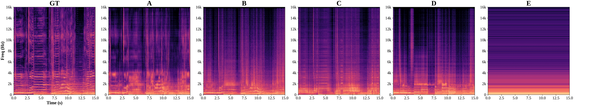

# εar-VAE2

[[Demo Page](https://eps-acoustic-revolution-lab.github.io/EAR_VAE2/)] - [[Paper (coming soon)](#)] - [[Models](https://huggingface.co/earlab/EAR_VAE2)]

---

<p align="center">
  
</p>

## Overview

A spectral-domain music autoencoder compressing **48 kHz stereo** audio into a **128-dimensional** continuous latent sequence at **25 Hz** — a **1920× temporal downsampling** — through two frequency-aware components: **Spec-SnakeBeta** (per-bin periodic activation with log-frequency initialization) and a **Duplex-Aware Refiner** (band-specific magnitude/phase correction motivated by psychoacoustic masking).

## ✨ Highlights

- 🎵 **Complex spectral domain** — operates on STFT real/imag channels, not raw waveform
- 🧬 **Spec-SnakeBeta** — per-(channel, frequency-bin) periodic activation with log-frequency initialization; each bin learns its own oscillatory bias
- 🎛️ **Duplex-Aware Refiner** — band-specific mag/phase correction following psychoacoustic dominance (phase-only < 1.5 kHz, joint mid-band, mag-only > 4 kHz)
- 📊 **1920× compression** — 48 kHz stereo → 128-d × 25 Hz continuous latent
- 🏆 **SOTA reconstruction** on Song Describer Dataset across spectral metrics

## Main Results

Reconstruction quality on **Song Describer Dataset** (546 full tracks, 48 kHz stereo):

| System | SI-SDR ↑ | STFT Dist ↓ | Mel Dist ↓ | CCPC ↑ |
|--------|:---:|:---:|:---:|:---:|
| εar-VAE | 12.4 | 0.880 | 0.509 | 0.973 |
| SA-Open | 6.7 | 1.016 | 0.612 | 0.933 |
| Levo 2 | 8.1 | 0.971 | 0.599 | 0.947 |
| SAME-L | 12.5 | 0.986 | 0.539 | 0.970 |
| **εar-VAE2 (base)** | 10.9 | 0.916 | 0.572 | 0.966 |
| **εar-VAE2 (full)** | **11.3** | **0.870** | **0.461** | **0.973** |

> εar-VAE2 (full) achieves the best spectral fidelity (STFT Dist, Mel Dist) among all systems while matching the phase coherence (CCPC) of the larger εar-VAE baseline.

## Spec-SnakeBeta

<p align="center">
  
</p>

*Per-(channel, frequency-bin) periodic activation with log-scale parameterization. Low-frequency bins stay near-identity; high-frequency bins become progressively oscillatory — providing a physically motivated inductive bias for spectral processing.*

## Input Representation

<p align="center">
  
</p>

*Complex STFT preserves organized high-frequency harmonic structure (panel A) where the same-backbone waveform-patch paradigm degrades (panel B). The spectral domain provides a physical frequency-axis inductive bias unavailable to waveform methods.*

## Installation

```bash
# Clone the repository
git clone https://github.com/Eps-Acoustic-Revolution-Lab/EAR_VAE2.git
cd EAR_VAE2

# Install dependencies
pip install -r requirements.txt

# Download pretrained weights (coming soon)
# huggingface-cli download eps-acoustic-revolution-lab/ear-vae2-small --local-dir checkpoints/
```

## Usage

### Python API

```python
import torch
from ear_vae2 import EarVAE2

# Load model (full model, with refiner — see configs/ear_vae2.json)
config = {
    "C0": 64, "D": 128, "use_vae": True,
    "refiner": {"type": "banded", "dim": 256, "intermediate_dim": 1024,
                "num_layers": 12, "layer_norm_eps": 1e-5},
}
model = EarVAE2(config)
ckpt = torch.load("ear_vae2.pt", map_location="cpu")
model.load_state_dict(ckpt["gen"] if "gen" in ckpt else ckpt)
model.eval().cuda()

# Encode & decode
audio = torch.randn(1, 2, 48000 * 10).cuda()  # 10s stereo @ 48kHz
audio_padded, orig_len = model.preprocess_audio(audio)
latents = model.encode_audio(audio_padded, chunked=True, chunk_size=512, overlap=16, deterministic=True)
reconstructed = model.decode_audio(latents, chunked=True, chunk_size=512, overlap=16)
reconstructed = reconstructed[:, :, :orig_len]
```

### Command Line

```bash
python inference.py --checkpoint ear_vae2.pt --config configs/ear_vae2.json --input input.wav --output output.wav
```

<details>
<summary><b>📁 Project Structure</b></summary>

```
EAR_VAE2/
├── README.md
├── LICENSE
├── requirements.txt
├── inference.py                 # CLI inference script
├── configs/
│   └── ear_vae2.json           # Full model config (with refiner)
├── ear_vae2/
│   ├── __init__.py
│   └── model.py                # Self-contained EarVAE2 model
│                               #   (encoder, decoder, Spec-SnakeBeta,
│                               #    refiner, STFT helpers)
├── assets/
│   ├── architecture.png
│   ├── spec_snakebeta.png
│   └── input_repr.png
└── docs/                       # Demo page (GitHub Pages, served from /docs)
    ├── index.html
    ├── config.js
    ├── css/
    ├── js/
    ├── assets/
    └── cases/
```

</details>

## Model Details

| Config | Params (M) | Latent dim | Rate (Hz) | Compression |
|--------|:---:|:---:|:---:|:---:|
| Small (C0=64) | ~42.6 | 128 | 25 | 1920× |

- **Sample rate**: 48 kHz stereo
- **STFT**: 3840-point FFT, 1920-sample hop → 25 Hz frame rate
- **Latent**: 128-d continuous (VAE with KL regularization)
- **Refiner**: 12-layer banded Transformer (256-d, 1024 intermediate)

> **⚠️ Note on open-source weights:**  Due to data licensing constraints, the open-source model weights are **retrained on publicly available datasets** (not the full internal training corpus). Performance may differ from the numbers reported in the paper, which were obtained with the full-scale proprietary training data.

---

## Citation

```bibtex
@inproceedings{earvae2,
  title     = {Frequency-Aware Spectral Autoencoding for High-Fidelity Music Reconstruction},
  author    = {Anonymous},
  booktitle = {International Conference on Learning Representations (ICLR)},
  year      = {2026}
}
```

---

## Acknowledgements

We gratefully acknowledge the following projects that inspired components of εar-VAE2:

- [**BigVGAN**](https://github.com/NVIDIA/BigVGAN) — SnakeBeta periodic activation design
- [**Vocos**](https://github.com/gemelo-ai/vocos) — ConvNeXt block architecture for spectral modeling
- [**Stable Audio Tools**](https://github.com/Stability-AI/stable-audio-tools) — Training infrastructure and audio pipeline patterns

---

## License

This project is licensed under the [Apache License 2.0](LICENSE).

Copyright 2026 Epsilon Acoustic Revolution Lab.
